# Veracode Static + SCA Scan

Setup an AWS CodeBuild project with Veracode Static and Software Composition Analysis.

## Overview

For this demonstration we will use the PetStoreAPI written in Python.  

https://github.com/veracode/petstore-api-flask

General steps are checkout code, build code, then upload the artifact for scanning.  For Dynamic scanning, we'll run the app and scan it.

If you plan to use your own project, we simply need to have a ZIP file passed into the Veracode Scan.
This approach uses the Veracode API Wrapper for submitting the scan.  

Veracode integrates with products in the AWS CodeSuite, specifically CodeBuild and CodePipeline.

### Steps
* Generate Veracode API Keys in Veracode platform
* Create CodeBuild Project in AWS
* Use the below sample buildspec.yml to checkout code, artifact code, and scan artifact for security flaws.

Video Overview:

](https://ezwp.tv/V8ajQ9dl)

Create Build Project

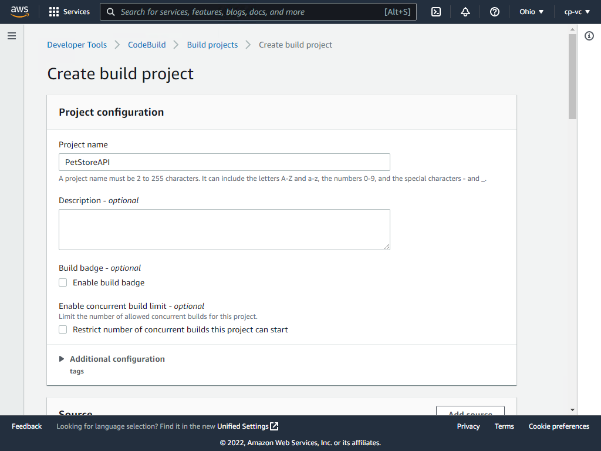

Select No source (the below buildspec.yml will download the source code for us).

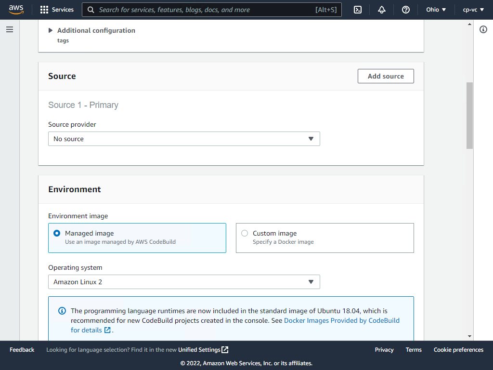

Use the below values in the Environment section and then expand the Additional configuration section.

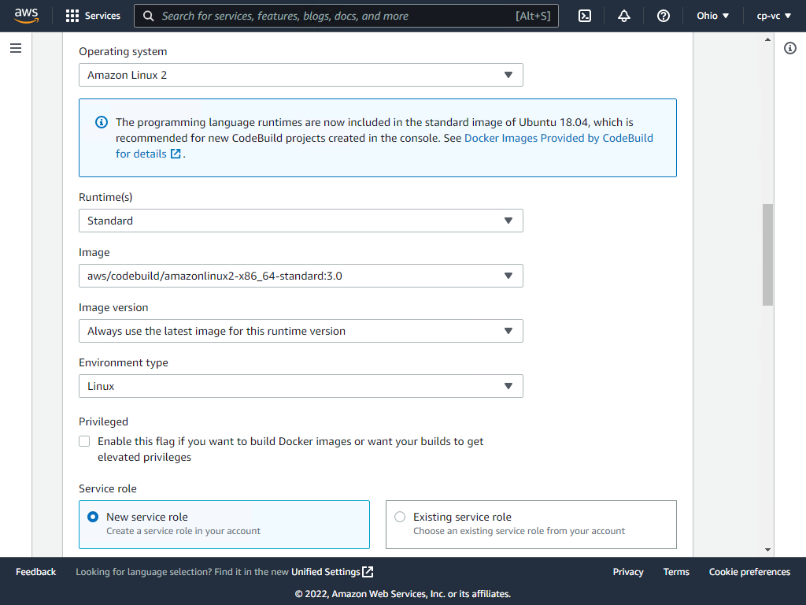

Create two environment variables, VID and VKEY and enter your Veracode API credentials created from the Veracode platform.

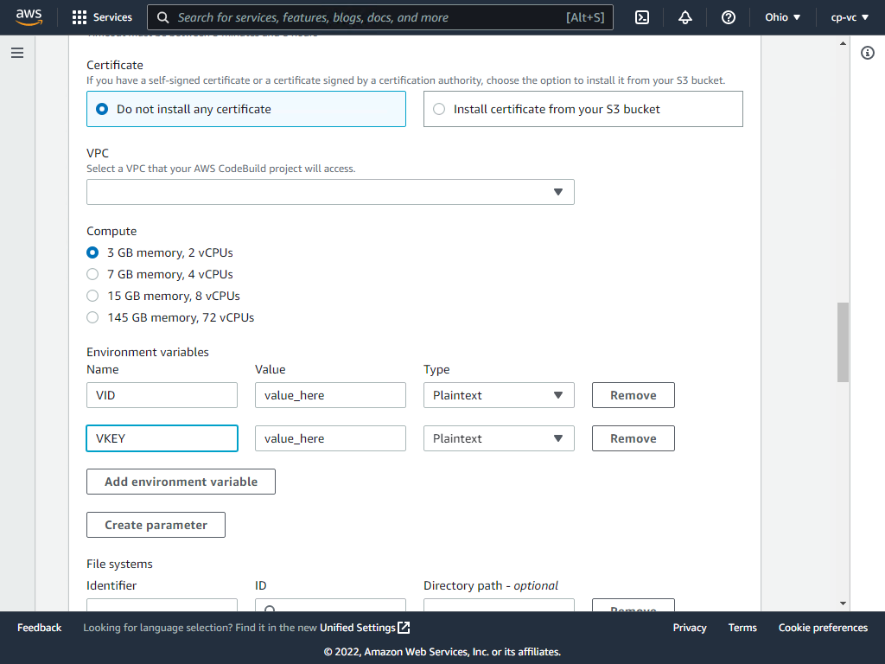

Click insert build commands and then switch to editor and enter the YAML below.  This example uses the Veracode Wrapper to assist with scan submission. See a full list of options here - https://docs.veracode.com/r/r_wrapper_parameters


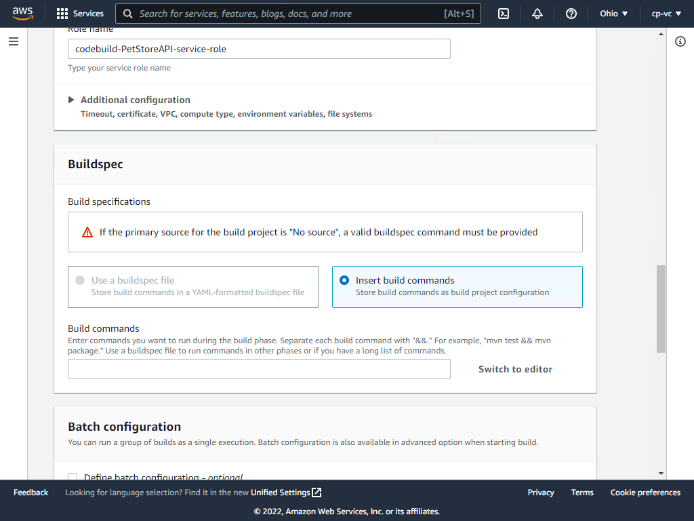

Be sure to remove the existing sample yml before pasting this yml. The sample buildspec.yml provided will automatically download the code, zip it, download the Veracode API wrapper, and submit for scanning.

```bash
version: 0.2

phases:
  build:
    commands:
      # Checkout code
      - git clone https://github.com/veracode/petstore-api-flask
      # Create an optimized ZIP file for scanning which contains only the files we need
      - zip petstore-api.zip petstore-api-flask/api.py petstore-api-flask/requirements.txt
  post_build:
    # Download the Veracode API wrapper and submit the app for a Static Policy + SCA scan
    commands:
      - curl -O https://repo1.maven.org/maven2/com/veracode/vosp/api/wrappers/vosp-api-wrappers-java/22.5.10.0/vosp-api-wrappers-java-22.5.10.0.jar
      - java -jar vosp-api-wrappers-java-22.5.10.0.jar -vid $VID -vkey $VKEY -appname AWSCodeBuild-PetStoreAPIv4 -action UploadAndScan -createprofile true -criticality Medium -version $CODEBUILD_BUILD_ID -filepath petstore-api.zip
      # Login to the Veracode platform to see results. Visit here to more options - https://docs.veracode.com/r/r_wrapper_parameters
```


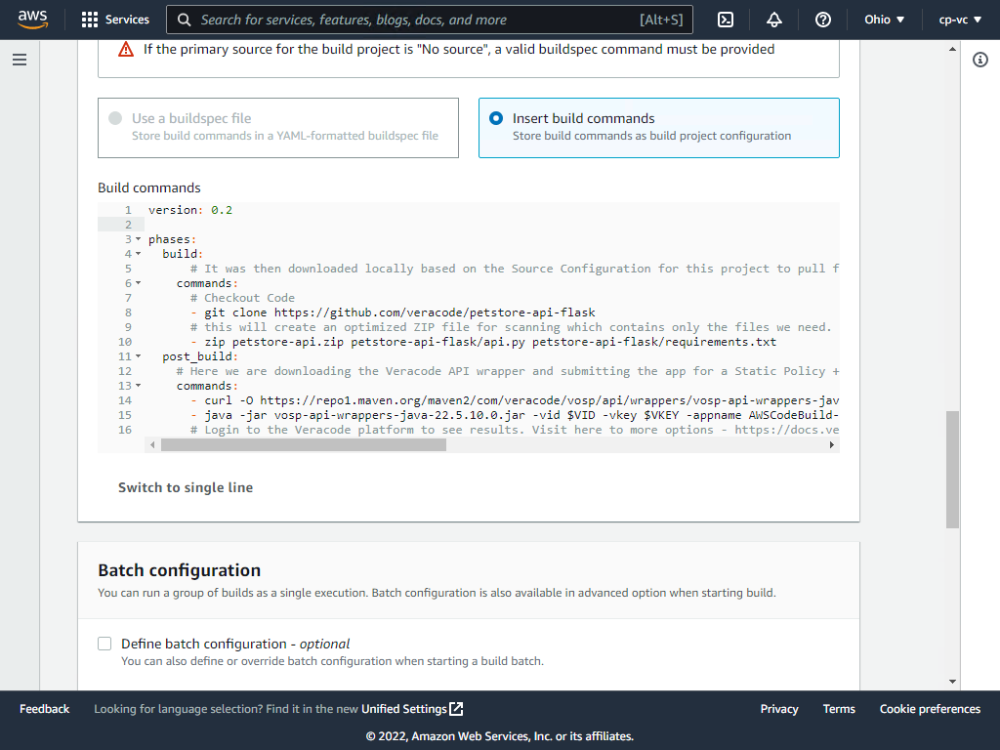

Start the build

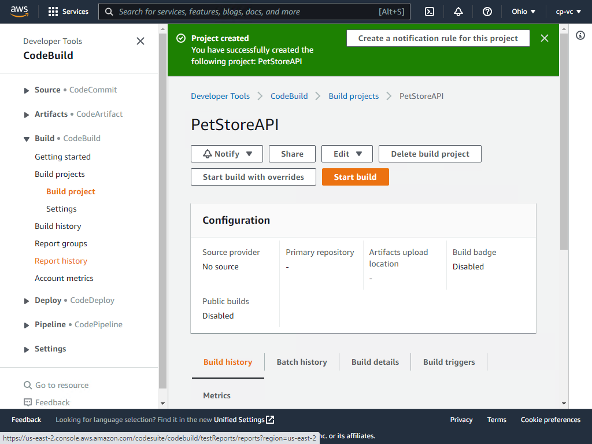

It should succeed

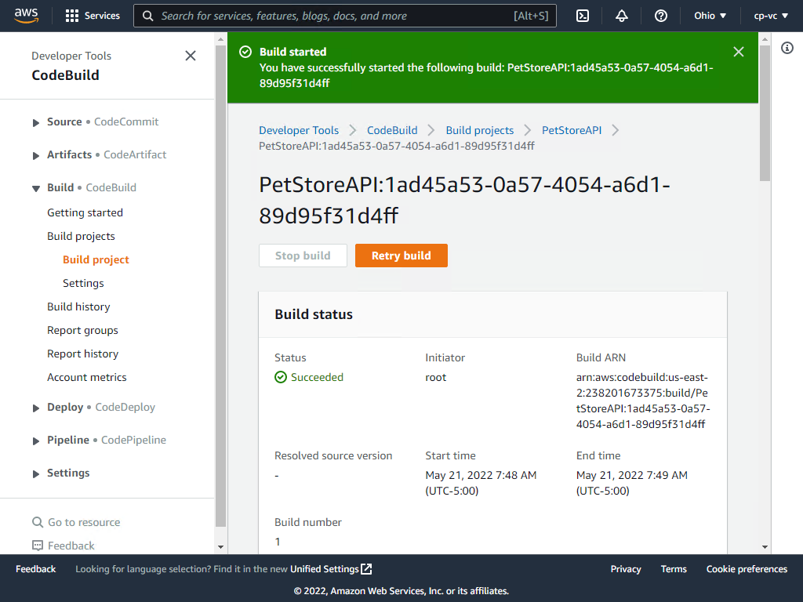

Review the log

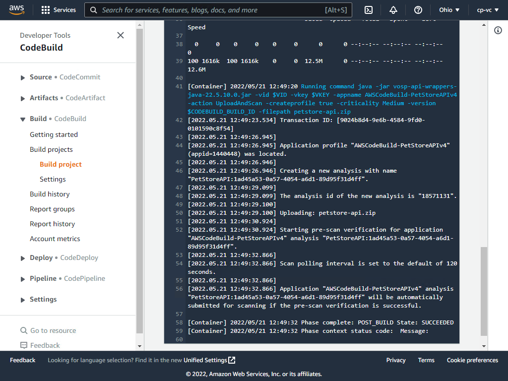

Navigate to the Veracode platform to view the results.  This is a purposely built vulnerable app to demonstrate basic scanning.

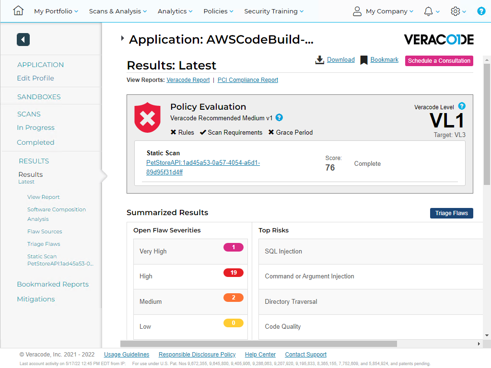

Consistency in scan results is what helps us to be successful in managing application security risk.  From here, we can clearly see when a new flaw is added. Consult Veracode Support for more advice on architecting this into your pipeline workflow.

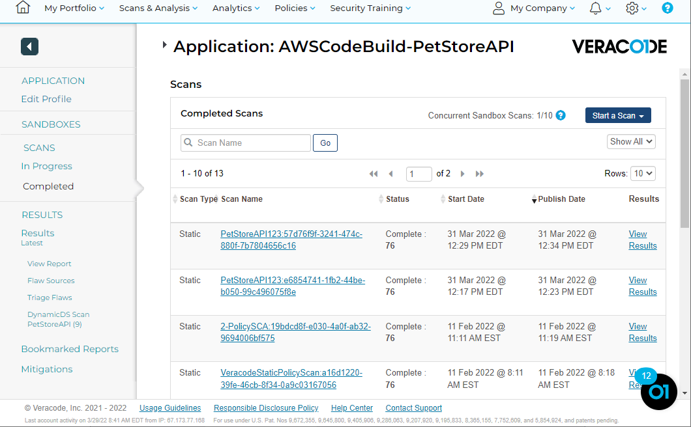


### Submit a Dynamic Runtime Test [Quickstart-DAST](/QuickStart-DAST)

### If you are looking to go further, see the [AWS Veracode Advanced Guide](/Advanced)