## Step 1 Initial Setup

We'll need an AWS account and a Veracode subscription.  Costs are low for running Cloud9, CodeBuild, and CodePipeline projects and will be in the free tier for this excercise. 

https://console.aws.amazon.com/

Once signed up, navigate to CodeCommit, and create a repository called PetStoreAPI

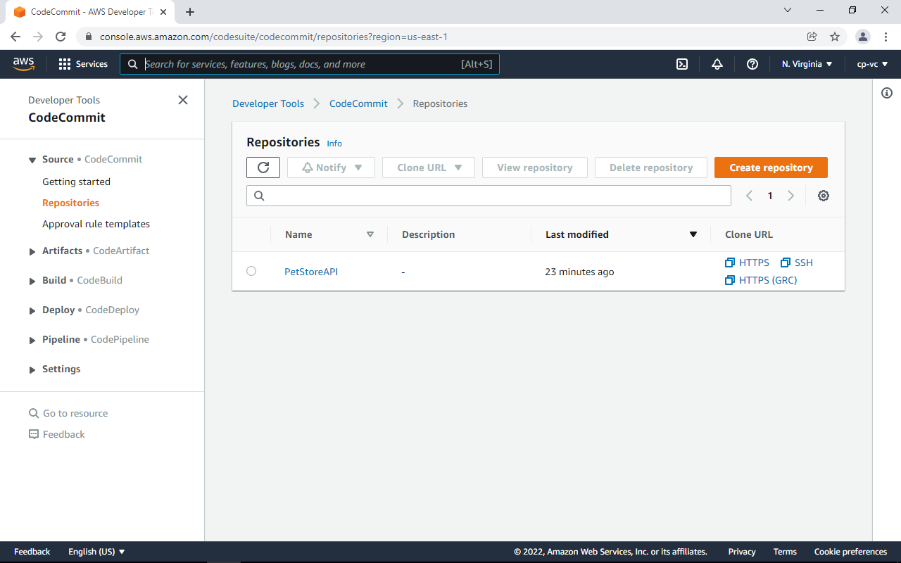

Note the Clone URL for later use.
Now we need to get the PetStoreAPI code into AWS CodeCommit. One of the easier ways of doing this is to use an AWS Cloud9 IDE.

Navigate to Cloud9 and create a new environment. Defaults are fine.
Lets create an S3 bucket we can use to store build artifacts and Veracode results.
Once Cloud9 is up, copy and paste this command into the terminal to create your S3 bucket. It will need to be a unique bucket name not used by anyone else.


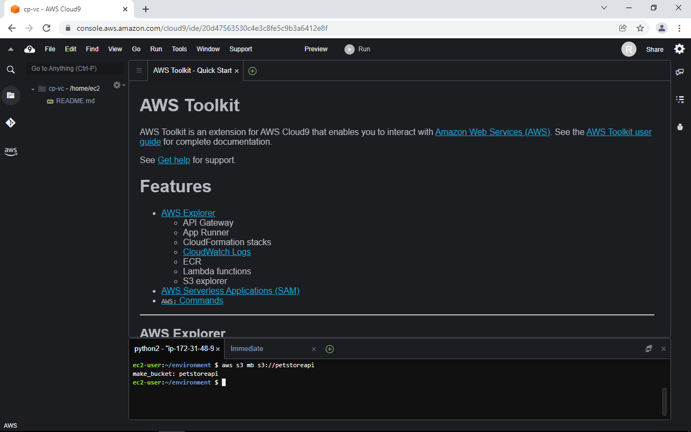

To make Cloud9 Terminal easier to use, you can go to Preferences - User Settings - Terminal to change the font, and you can also maximize the terminal window.

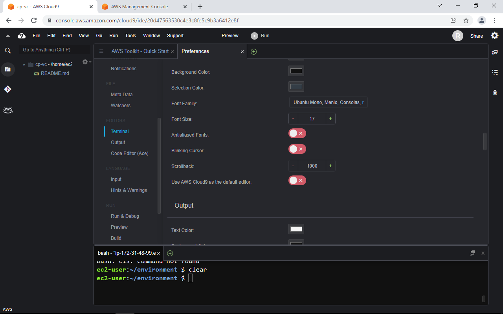

Now use the terminal to run this command to create your S3 bucket.  Be sure to customize the bucket name.

```bash
aws s3 mb s3://petstoreapi(InsertRandonNumberLetter)
```

To clone the PetstoreAPI into AWS we need to run a few commands.

Grab the Clone URL from your CodeCommit repo, such as https://git-codecommit.us-east-1.amazonaws.com/v1/repos/PetStoreAPI2

Now we need to configure git within your Cloud9 IDE and integrate it with your CodeCommit repository.

You don’t need to use your true name or email.

```bash
git config --global user.name "Me"
git config --global user.email me@me.com
git config --global credential.helper '!aws codecommit credential-helper $@'
git config --global credential.UseHttpPath true
```

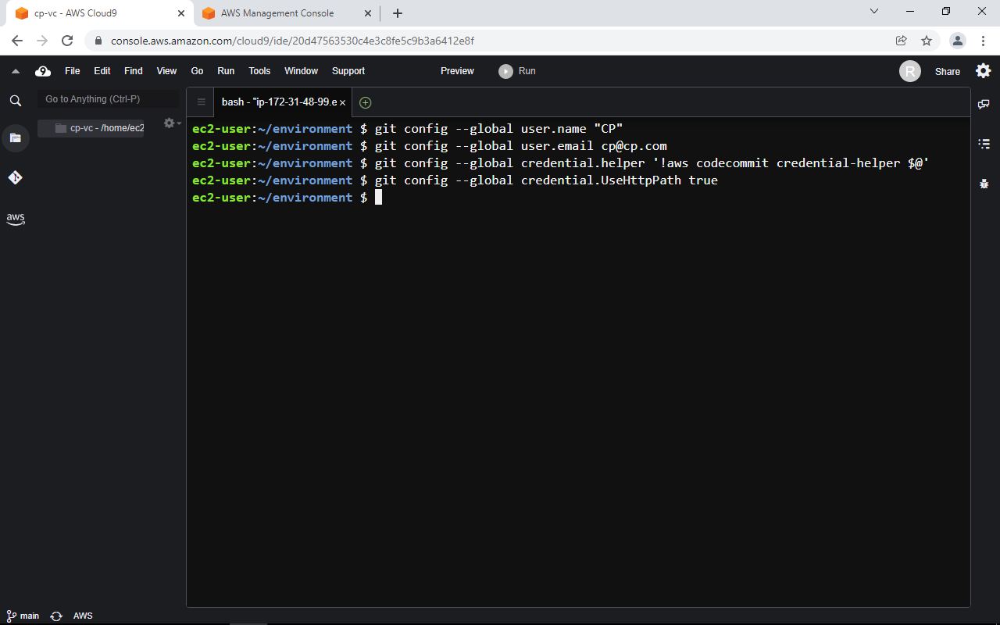

Now, we are ready to clone our AWS repository to our Cloud9 using the following terminal command -

Update your Repo URL.

```bash
git clone https://git-codecommit.us-east-1.amazonaws.com/v1/repos/PetStoreAPI2
```

It will tell you the repository is empty.

Clone PetStoreAPI from the official Veracode repo, and then files into our AWS repo.

```bash
git clone https://github.com/veracode/petstore-api-flask
cp -r ~/environment/petstore-api-flask/* ~/environment/PetStoreAPI/
```


## Pushing code to AWS CodeCommit
After saving the file, change directories to the new repository directory, and update the branch to main if not already:

```bash
cd ~/environment/PetStoreAPI/
git branch -m master main
git add .
git commit -m "bringing in the code"
git push
```

Open another tab in your browser and keep the Cloud9 IDE open:

https://console.aws.amazon.com/

Navigate to the CodeCommit service, and click on PetStoreAPI. You will see the source code has been uploaded. Now we can setup CodeBuild projects.

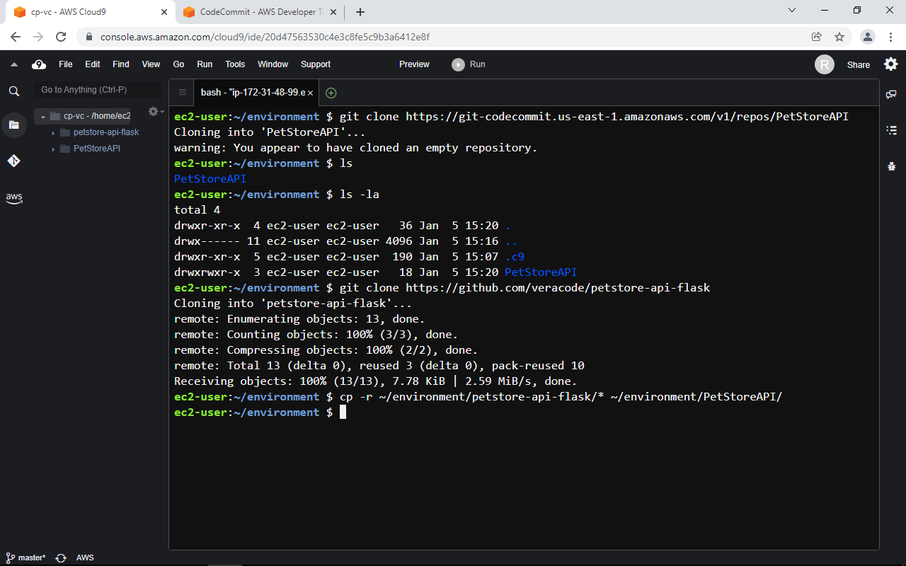

Click on CodeBuild on the left navigation menu.

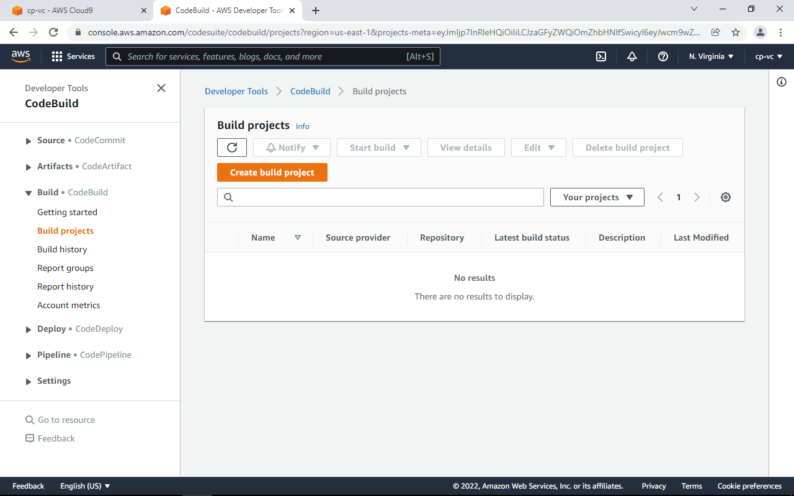


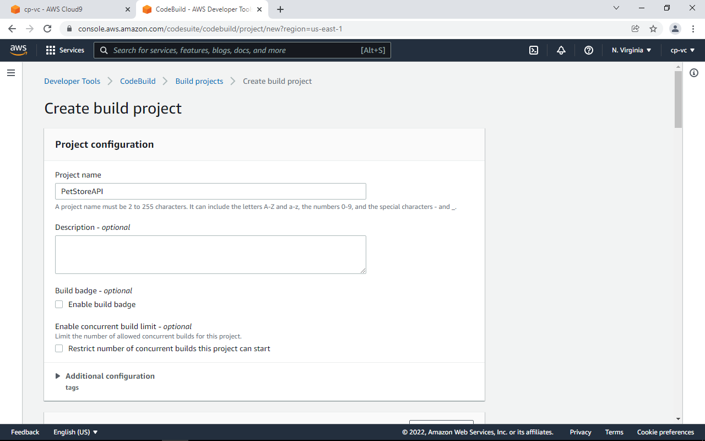

Point this build project to the PetStoreAPI CodeCommit Repo.

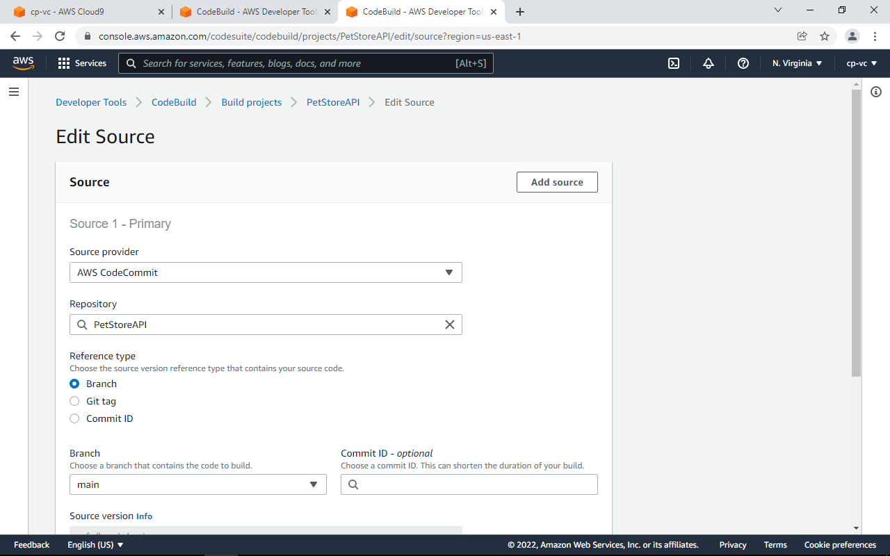

Use the managed image option with the below settings.

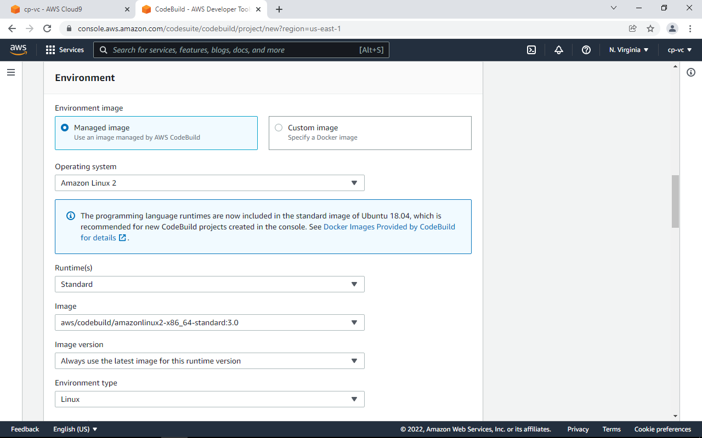

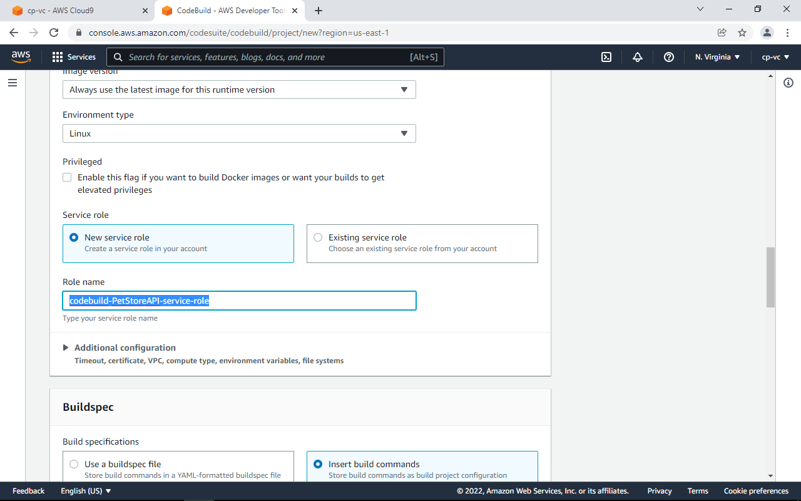


Select the Insert Build Commands option, and then replace the default with the optimized buildspec below.   Since this is Python, our build step will simply ZIP the files. AWS expects artifacts to be passed between CodePipeline steps as zip files. This will archive the file to the S3 bucket we created.  This will download the source, zip it up, and then store as an artifact in your S3 bucket to pull.

```bash
version: 0.2

phases:
  build:
    commands:
      - zip petstoreapi.zip *
artifacts:
  files:
    - petstoreapi.zip
```

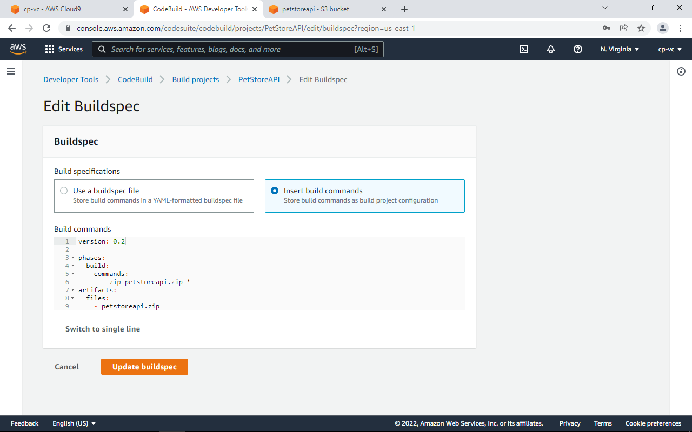

Set the Artifacts to the S3 bucket.  If no name entered into the Name section, it will create a sub folder with the CodeBuild project name.

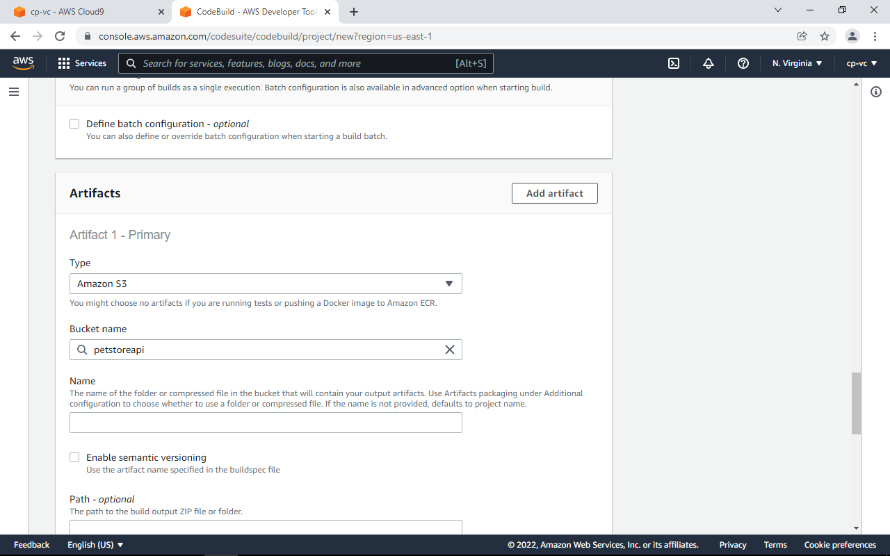

Everything else is default. Create the Build Project, and then start the project to see if it works.

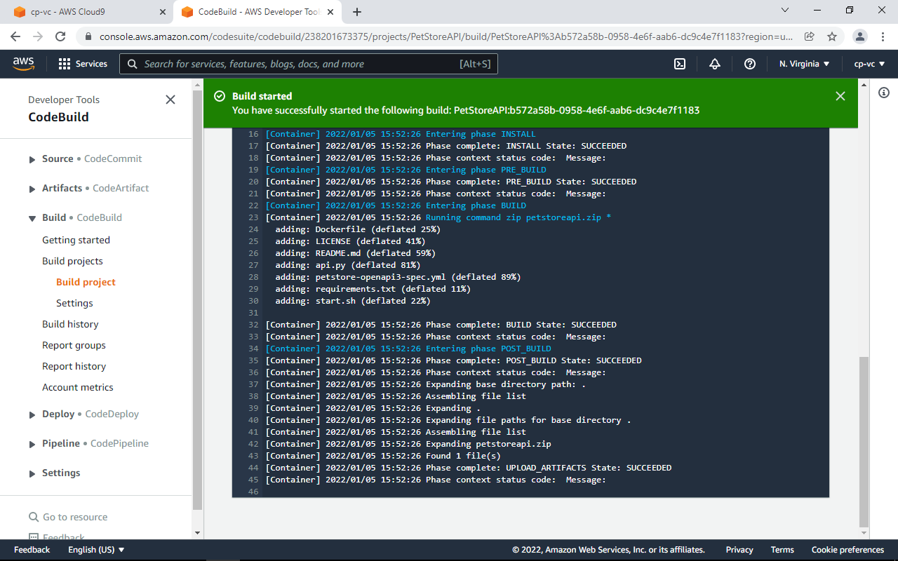

Here you can see the artifact in your S3 bucket.

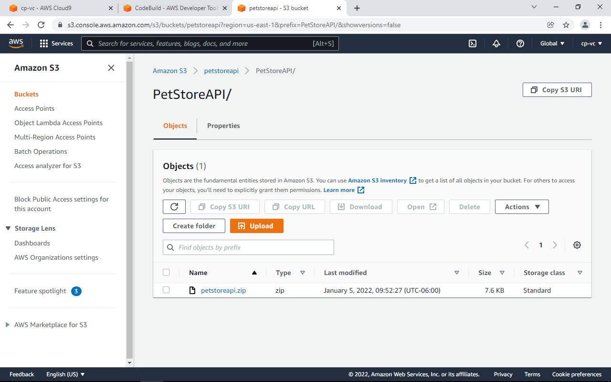

## [Proceed to Step  2](2-SecretsSetup)
Setting up the Veracode VID, VKEY, and SRCCLR_API_TOKEN in the AWS Secrets Manager.