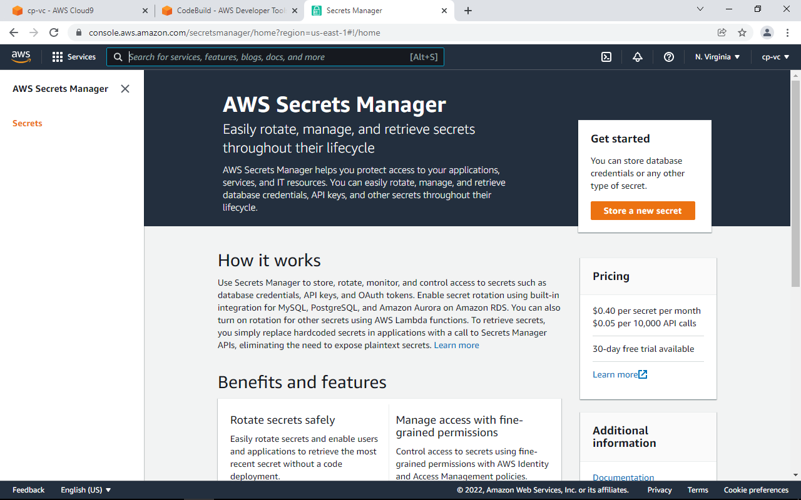
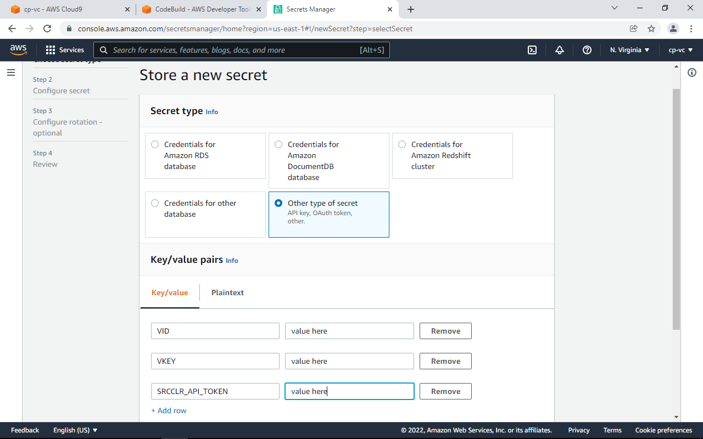
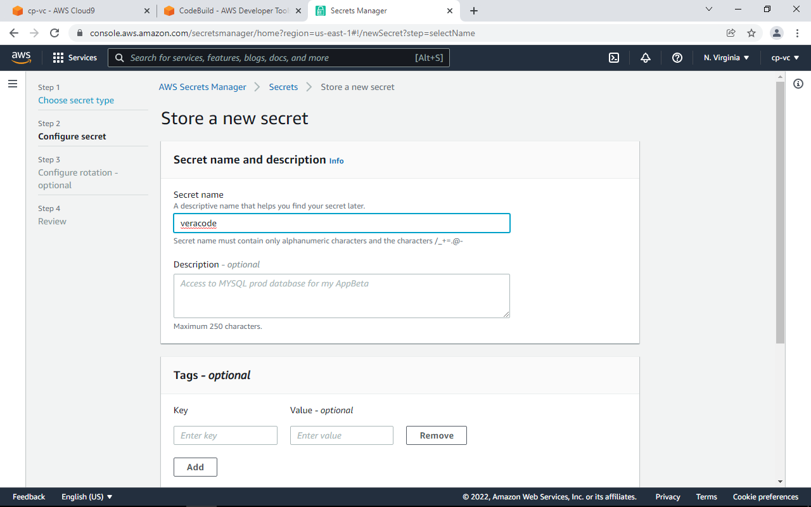
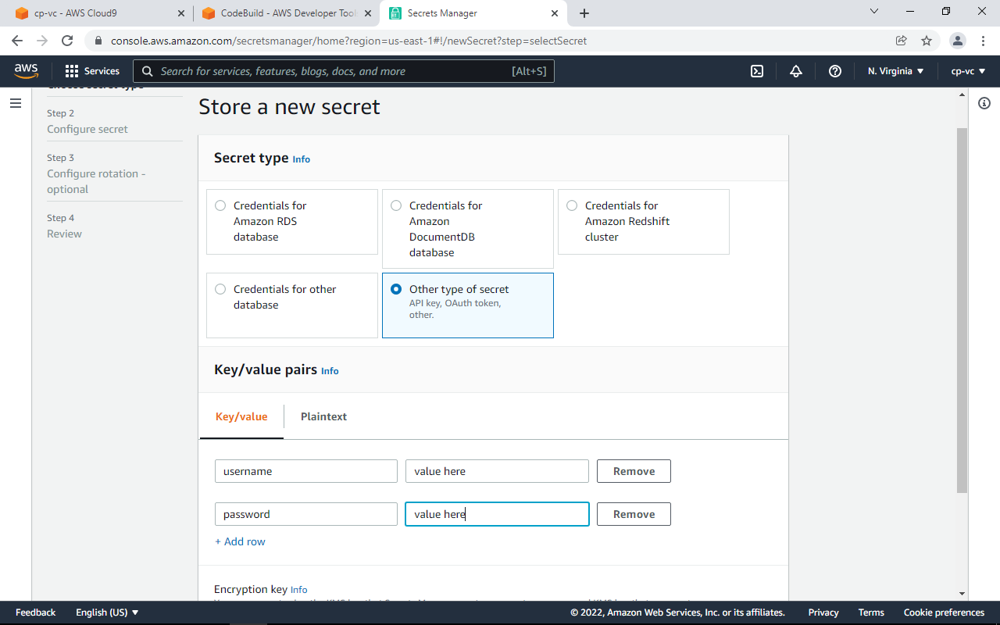
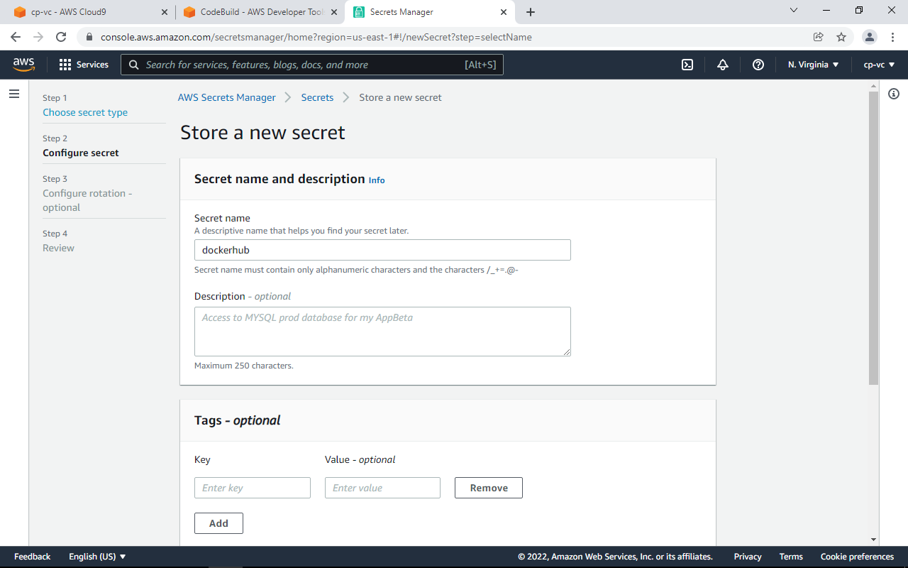
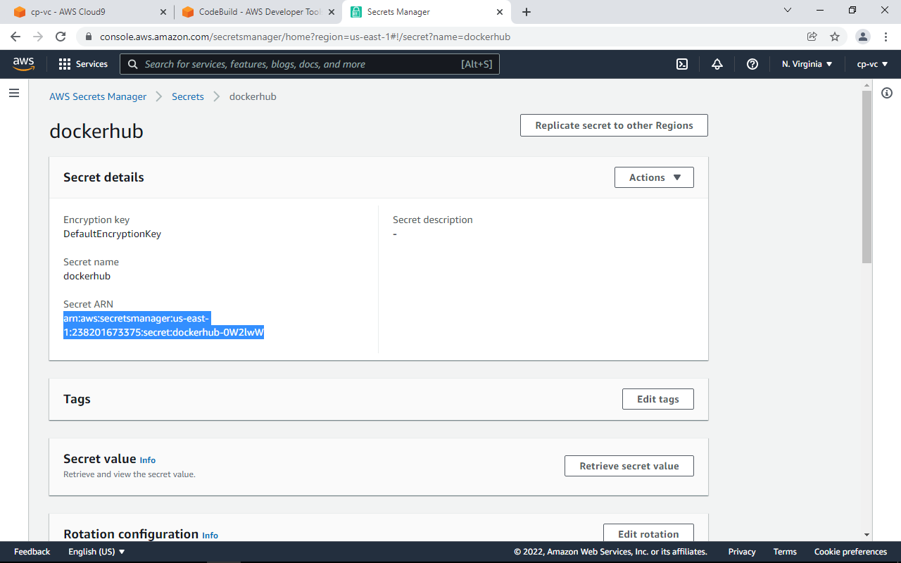

# Veracode API Keys and Docker Secrets Configuration

Next we will setup credentials in the AWS Secrets Manager so we can use Veracode and dockerhub services. We will setup Veracode API and Key and your dockerhub username and password. If you don’t have one, create a free dockerhub account. This is needed so that you can download the docker image into AWS CodeBuild.  It may take several tries to get the CodeBuild projects right. Use the output log to troubleshoot.

You'll also need to have a Veracode account and generate your API Credentials.  Onced logged in to Veracode, click the settings in the top right, and then API Credentials.

## Navigate to AWS Secrets Manager

Select Other type of secret, and enter three keys - VID, VKEY, and SRCCLR_API_TOKEN.

Name it, then keep defaults and store the secret.

Now we need to configure the DockerHub username. This allows us to avoid Docker Hub Rate Limiting Errors in CI/CD Pipelines. Customers may not be aware of this.  If you do not have one, create a free Docker account and enter that login detail here.

Next, retrieve the ARN values for the DockerHub key and store temporarily.

## [Proceed to Step  3](/Advanced/3-SecretsPermissions)

NOTE: After each CodeBuild project is created, you must follow this process to give your CodeBuild project premissions to the Secrets.