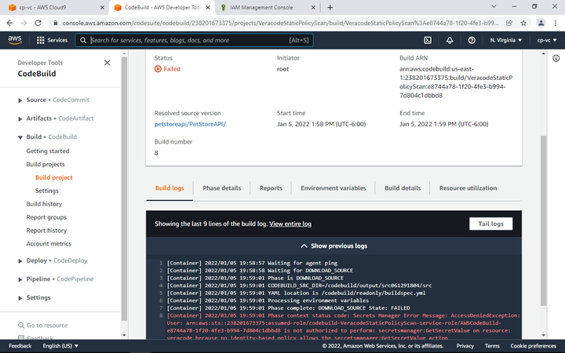
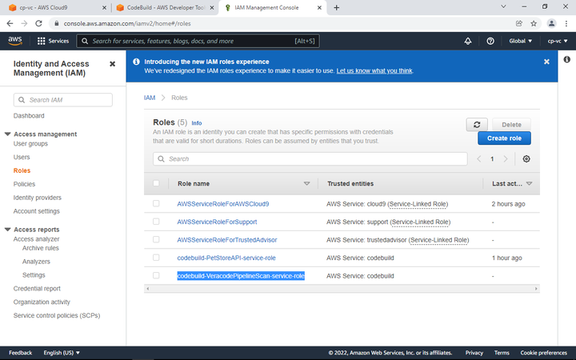

# Veracode API Keys and Docker Secrets Configuration

If you would like a more scalable approach managing keys you can leverage the AWS Secrets Manager to pass the API key information into the pipeline instead of using a pipeline specific variable.  Login to the Veracode platform to generate your VID, VKEY (under API Credentials top right) and the SCA Agent key under Software Composition Analysis, and then select Agent based scan.

## Navigate to AWS Secrets Manager

Select Other type of secret, and enter three keys - VID, VKEY, and SRCCLR_API_TOKEN.

Name it, then keep defaults and store the secret.

Now we need to configure the DockerHub username and password. This allows us to avoid Docker Hub Rate Limiting Errors in AWS CI/CD Pipelines. Signup for a free Docker account if you do not already have one.

Next, retrieve the ARN values for the DockerHub key and store temporarily.

NOTE: After each CodeBuild project is created, you must follow this process to give your CodeBuild project permissions to the Secrets.

# Secret Manager Permissions

Each new CodeBuild project must get permissions to access the secrets we created, otherwise you might get this error -

To fix, we must go into the IAM service, Identity and Access Management.

Click on Roles, and then you will see your Pipeline scanner role, in this case -

codebuild-VeracodePipelineScan-service-role

Click on the role, and then Attach Permissions. Search for SecretsManager, and check the box, then Attach the Policy.

Add this to the top of any buildspec that will run Veracode services via a Docker Image.

env:
  secrets-manager:

     VID: "veracode:VID"
     VKEY: "veracode:VKEY"
     DOCKERHUB_PASSWORD: "dockerhub:password"
     DOCKERHUB_USERNAME: "dockerhub:username"
     SRCCLR_API_TOKEN: "veracode:SRCCLR_API_TOKEN"

