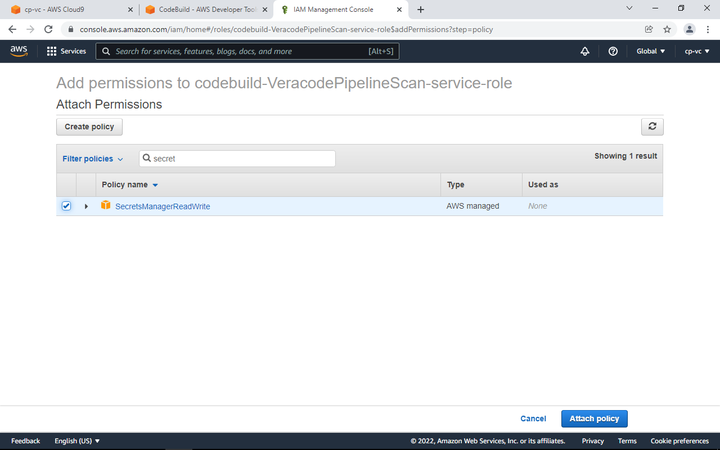

# Secret Manager Permissions

Each new CodeBuild project must get permissions to access the secrets we created, otherwise you might get this error -

To fix, we must go into the IAM service, Identity and Access Management.

Click on Roles, and then you will see your Pipeline scanner role, in this case -

codebuild-VeracodePipelineScan-service-role

Click on the role, and then Attach Permissions. Search for SecretsManager, and check the box, then Attach the Policy.

## [Proceed to Step  4](/Advanced/4-Static-SCA-Policy-Scan)

Now we are ready to add the step for Static Policy and SCA scans.
