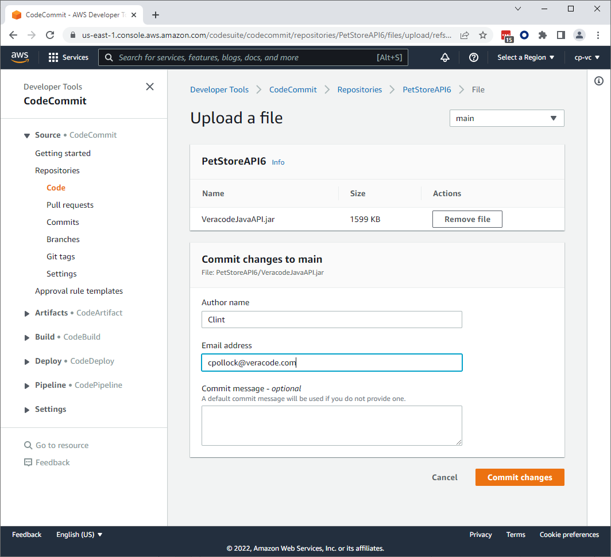
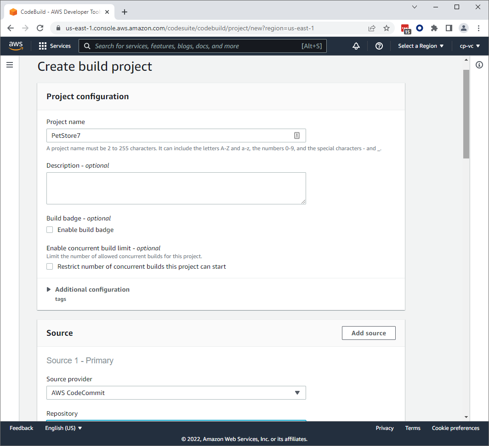
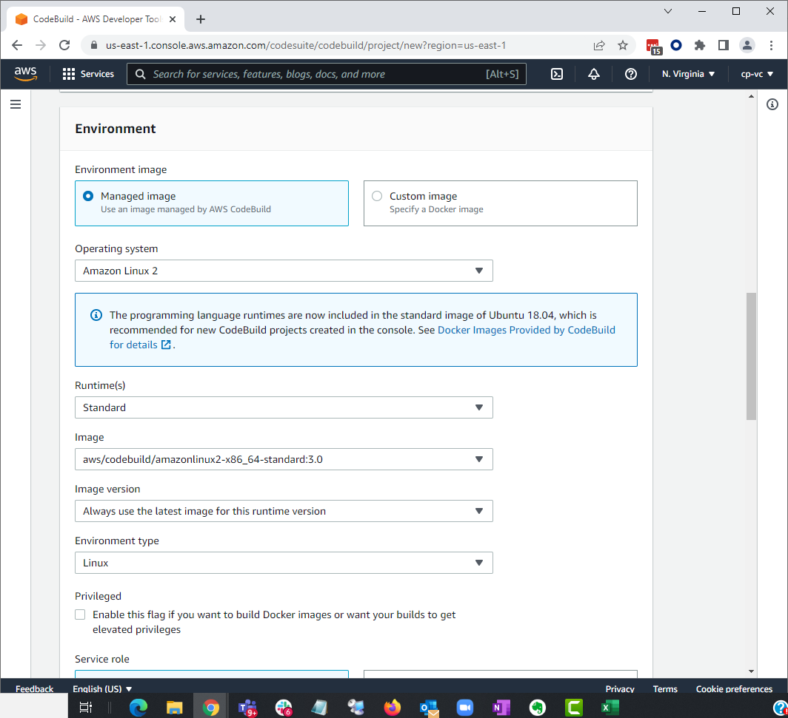
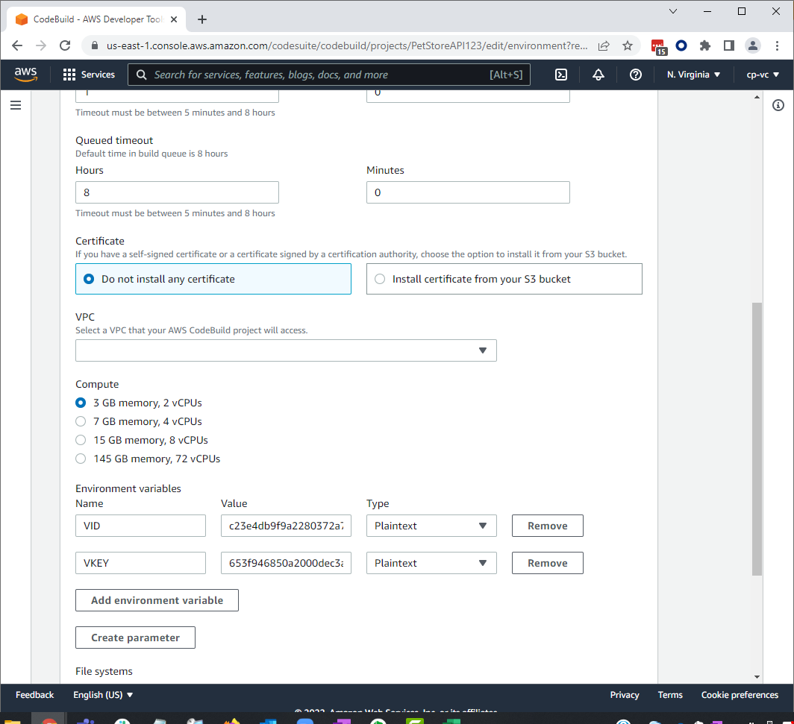
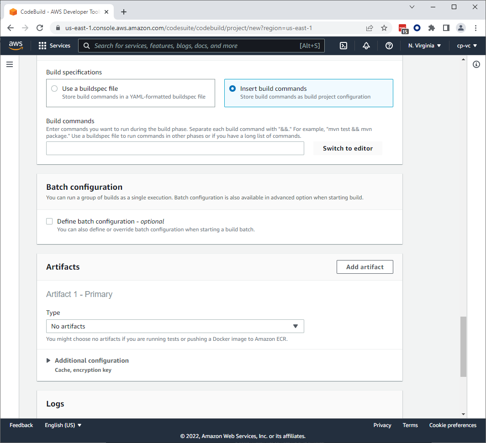
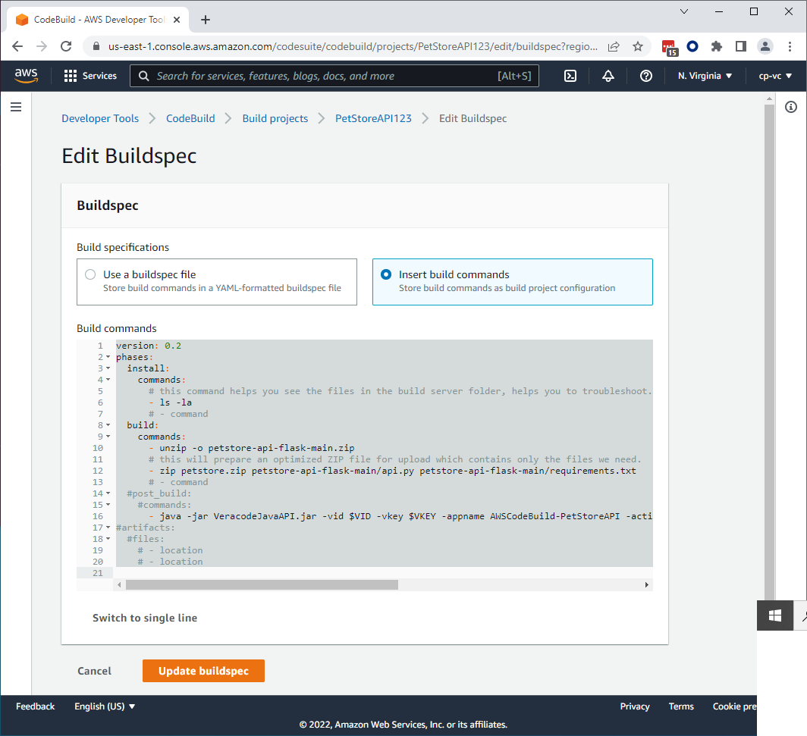
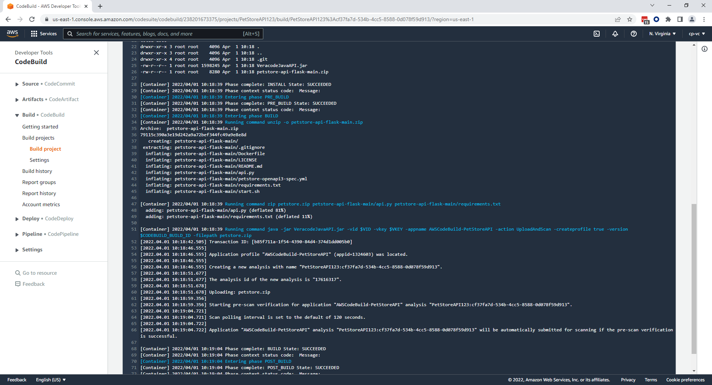

# AWS CodeSuite and Veracode

How to setup an AWS CodeBuild project with Veracode Static and SCA Analysis.

## Overview
A quick start guide

For this demonstration we will use the PetStoreAPI written in Python.  

If you plan to use your own project, we simply need to have a ZIP file passed into the Veracode Scan.
This approach uses the Veracode API Wrapper for submitting the scan.  

Veracode integrates with products in the AWS CodeSuite, specifically CodeBuild and CodePipeline.

### AWS products we’ll use:

* CodeCommit - this is where we’ll place the PetStoreAPI code.
* CodeBuild - this is the primary area we integrate Veracode commands. 

### General Flow Basic
* Create CodeCommit Repository 
* Create build artificat to ZIP artifact and scan with Veracode Policy SAST+SCA


Get started scanning with Veracode and AWS quickly using Static + SCA Policy scan.

The Free tier will cover our usage for this.  You will have to use your AMEX to setup the account.  

  Since flaws are generally not added on a day to day basis the only basic requirement is to have a SAST+SCA scan of the same artifact, built the same way, on a regular basis.  Some developers may shift left, but if you don’t add new flaws for 3 months in an app, you probably don’t need to scan every PR. Gather data is critical so that we can make good decisions on where to focus efforts and balance the risk. 

For the Quick Start we will use a simple Python app.

Visit this link and download ZIP.

GitHub - veracode/petstore-api-flask: A vulnerable API based on the Swagger Petstore API, built in Flask. 

https://github.com/veracode/petstore-api-flask


To get started with a Static Policy / SCA scan in AWS quickly, download the wrapper. Download the Dist.zip and extract the wrapper jar file from here -

Maven Central Repository Search - https://search.maven.org/search?q=a:vosp-api-wrappers-java

In AWS navigate to CodeCommit.  Create a new repo, and upload the petstore-api-flask-main.zip and VeracodeJavaAPI.jar.




Create a Build Project

Set your source location to the CodeCommit repo you just created.



In the Environment section use these options:


Expand the Additional Configuration section.  You can hard code the VID and VKEY, or use environment variables:



Click insert build commands and then switch to editor, and enter the YAML below.





Sample buildspec file for submitting a Static Policy Scan:

```bash
version: 0.2
phases:
  install:
    commands:
      # this command helps you see the files in the build server folder, helps you to troubleshoot.
      - ls -la
      # - command
  build:
    commands:
      - unzip -o petstore-api-flask-main.zip
      # this will prepare an optimized ZIP file for upload which contains only the files we need.
      - zip petstore.zip petstore-api-flask-main/api.py petstore-api-flask-main/requirements.txt
      # - command
  #post_build:
    #commands:
      - java -jar VeracodeJavaAPI.jar -vid VIDHERE -vkey VKEYHERE -appname AWSCodeBuild-PetStoreAPI -action UploadAndScan -createprofile true -version $CODEBUILD_BUILD_ID -filepath petstore.zip
#artifacts:
  #files:
    # - location
    # - location
```

Start the build and it should complete successfully.



Consistency is what helps us to be successful in managing application security risk.  Imagine yourself in the developers shoes and you are told to fix all these flaws, which no one budgeted for, and you did not create.  To have success, we must gain developer trust. For that to happen, we need consistent and accurate results.  For that to happen, we need to have the same artifact built the same way (at least for a Policy scan). 

From here, we can clearly see when a new flaw is added.  Now this is a much smaller workload and will be more accurate (if build / packaging done correct per compilation guide).  If the scan is being done differently each time, then we should suggest Sandbox or Pipeline scan earlier in the build process.  At some point, when the entire app comes together, perhaps a single micro service, or a collection of, they need to be packaged consistently and scanned the same way for the Policy Scan.  This will begin to give our customers a clearer picture of what apps are failing and which are passing.




## [If you are looking to go further, see the AWS Veracode Advanced guide](/Advanced)