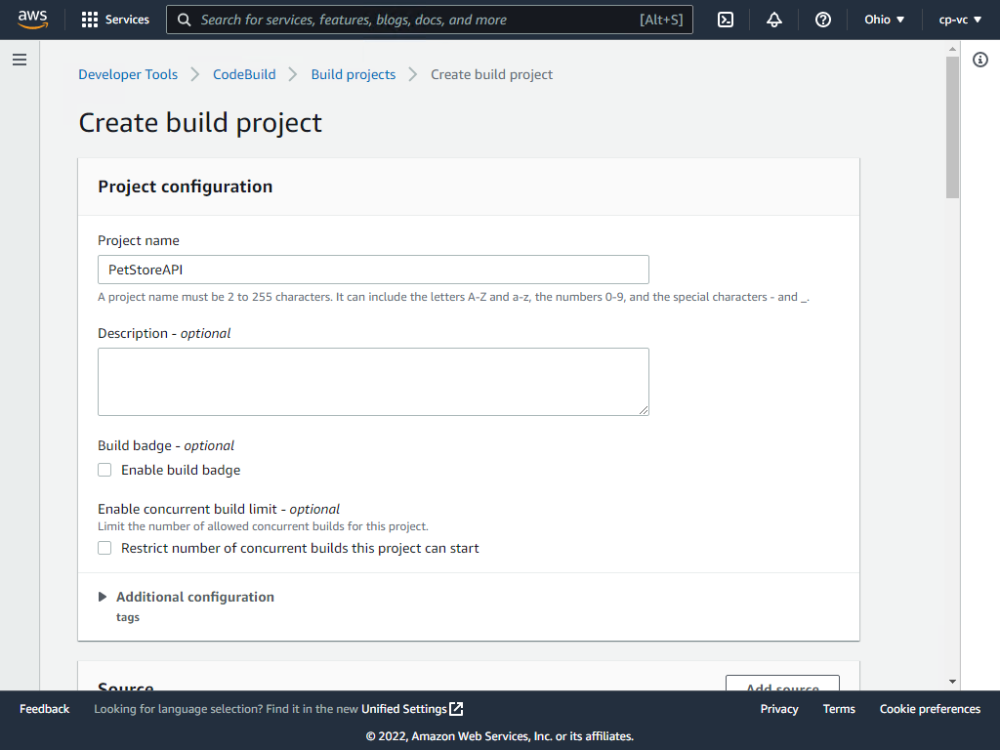
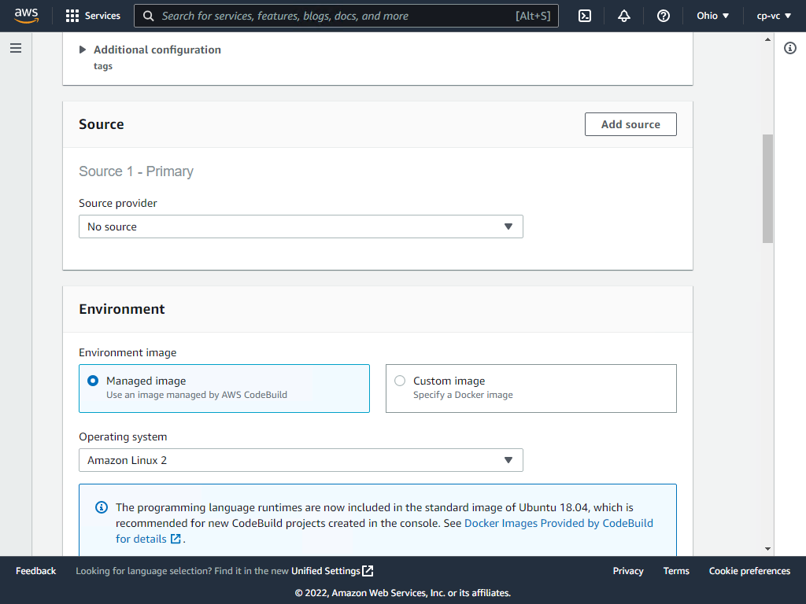
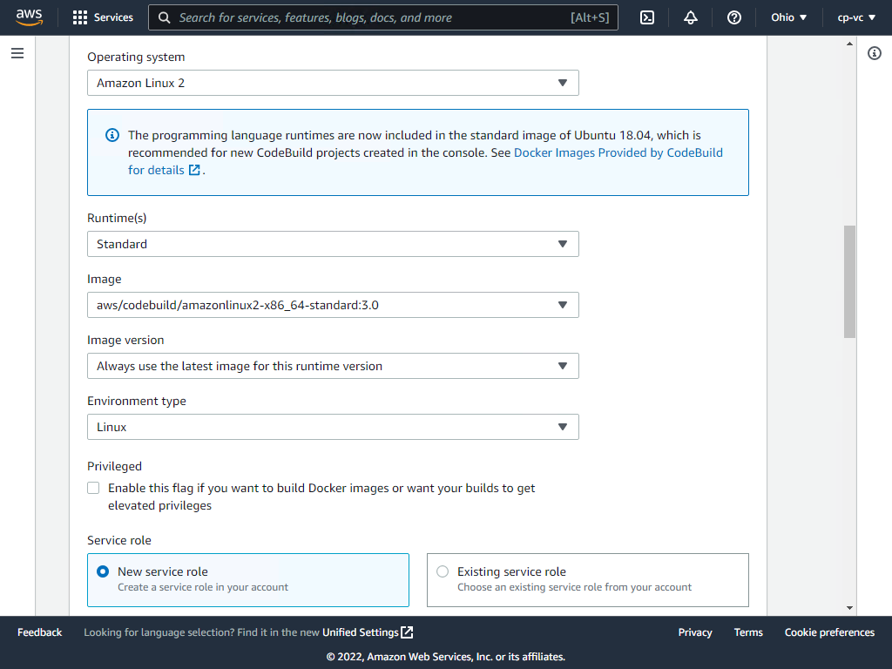
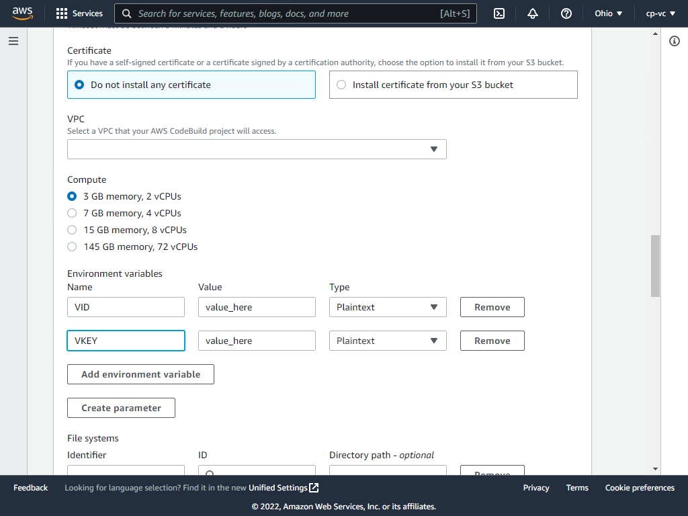
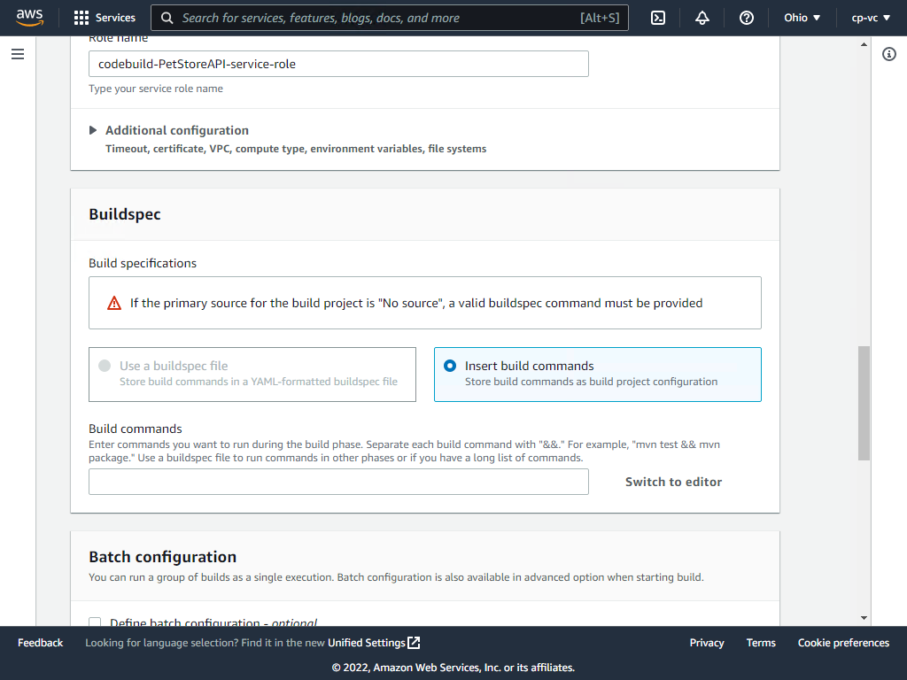
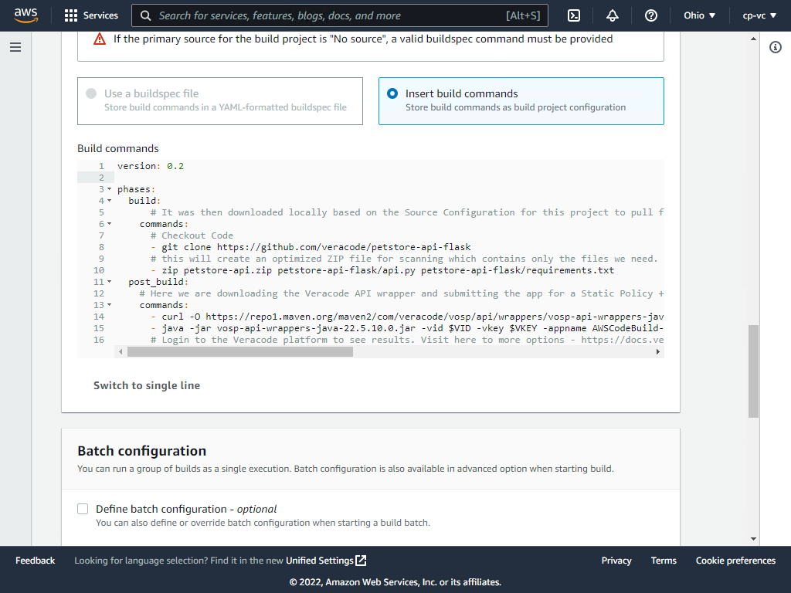
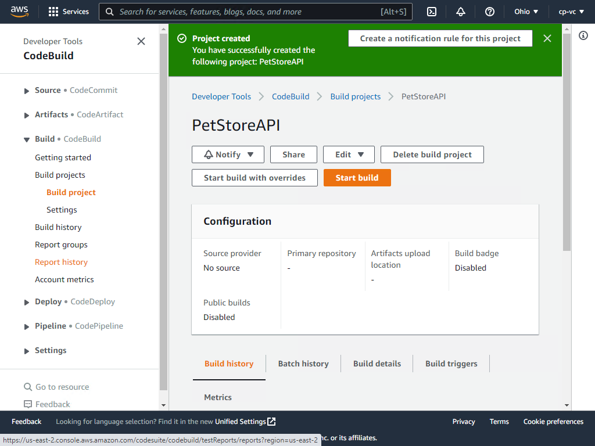
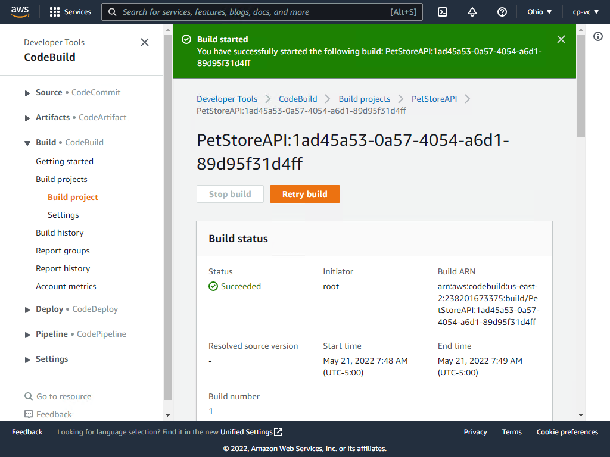
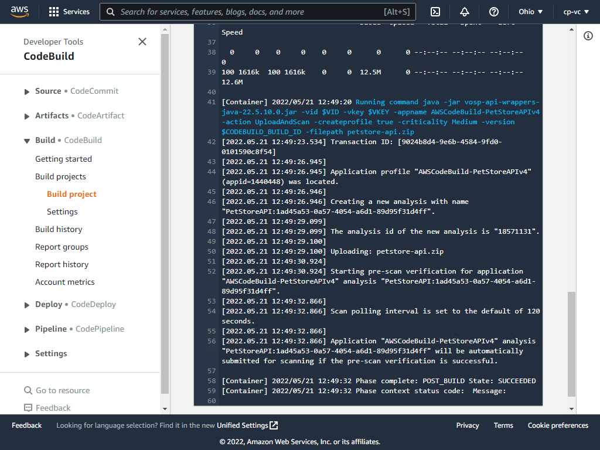
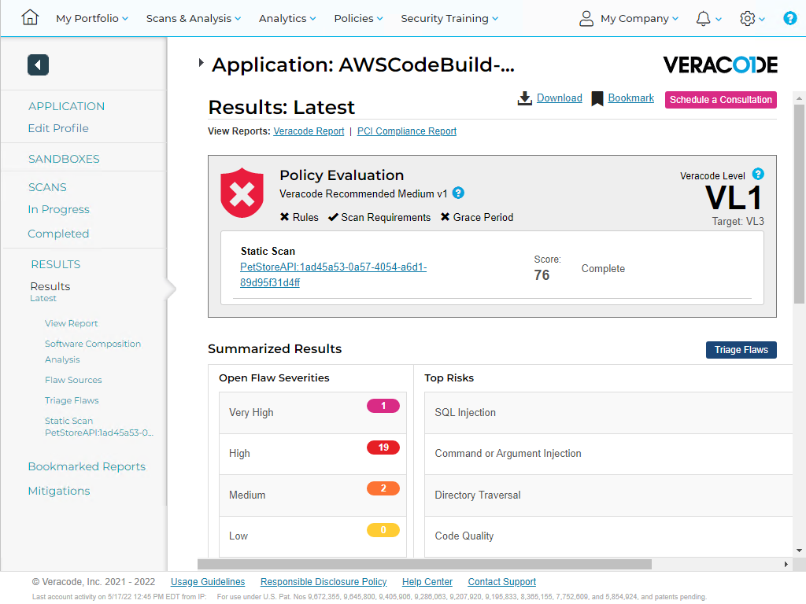

# AWS CodeSuite and Veracode

How to setup an AWS CodeBuild project with Veracode Static, SCA Analysis, and Dynamic Analysis.

## Overview

For this demonstration we will use the PetStoreAPI written in Python.  

General steps are checkout code, build code, then upload the artifact for scanning.  For Dynamic scanning, we'll run the app and scan it.

If you plan to use your own project, we simply need to have a ZIP file passed into the Veracode Scan.
This approach uses the Veracode API Wrapper for submitting the scan.  

Veracode integrates with products in the AWS CodeSuite, specifically CodeBuild and CodePipeline.

Login to the Veracode platform and generate your API keys.

### AWS products we’ll use:

* CodeBuild - this is the primary area we integrate Veracode commands. 

### Veracode products we'll use

* Static, Software Composition Analysis, and Dynamic API scanning

### General Flow Quick Start
* Generate Veracode API Keys in Veracode platform
* Create CodeBuild Project in AWS
* Use the below sample buildspec.yml to checkout code, artifact code, and scan artifact for security flaws.

For the Quick Start we will use a simple Python app.

You can download the source code from here.  The sample buildspec.yml will automatically download the code, zip it, and scan it.  

GitHub - veracode/petstore-api-flask: A vulnerable API based on the Swagger Petstore API, built in Flask. 

https://github.com/veracode/petstore-api-flask

Create Build Project


Select No source (the buildspec.yml will download it)


Use the below values in the Environment section and then expand the Additional configuration section.



Create two environment variables, VID and VKEY and enter your Veracode API credentials created from the Veracode platform.



Click insert build commands and then switch to editor and enter the YAML below.



```bash
version: 0.2

phases:
  build:
      # It was then downloaded locally based on the Source Configuration for this project to pull from the S3 bucket."
    commands:
      # Checkout Code
      - git clone https://github.com/veracode/petstore-api-flask
      # this will create an optimized ZIP file for scanning which contains only the files we need.
      - zip petstore-api.zip petstore-api-flask/api.py petstore-api-flask/requirements.txt
  post_build:
    # Here we are downloading the Veracode API wrapper and submitting the app for a Static Policy + SCA scan
    commands:
      - curl -O https://repo1.maven.org/maven2/com/veracode/vosp/api/wrappers/vosp-api-wrappers-java/22.5.10.0/vosp-api-wrappers-java-22.5.10.0.jar
      - java -jar vosp-api-wrappers-java-22.5.10.0.jar -vid $VID -vkey $VKEY -appname AWSCodeBuild-PetStoreAPIv4 -action UploadAndScan -createprofile true -criticality Medium -version $CODEBUILD_BUILD_ID -filepath petstore-api.zip
      # Login to the Veracode platform to see results. Visit here to more options - https://docs.veracode.com/r/r_wrapper_parameters
```



Start the build


It should succeed


Review the log


Navigate to the Veracode platform to view the results


Consistency in scan results is what helps us to be successful in managing application security risk.  From here, we can clearly see when a new flaw is added.  Consult Veracode Support for more advice on architecting this into your pipeline workflow.

## [If you are looking to go further, see the AWS Veracode Advanced guide](/Advanced)