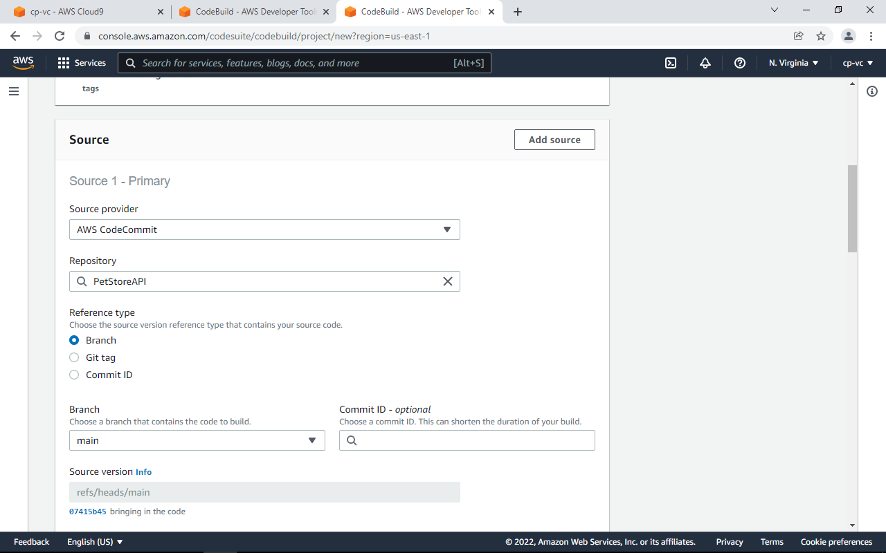
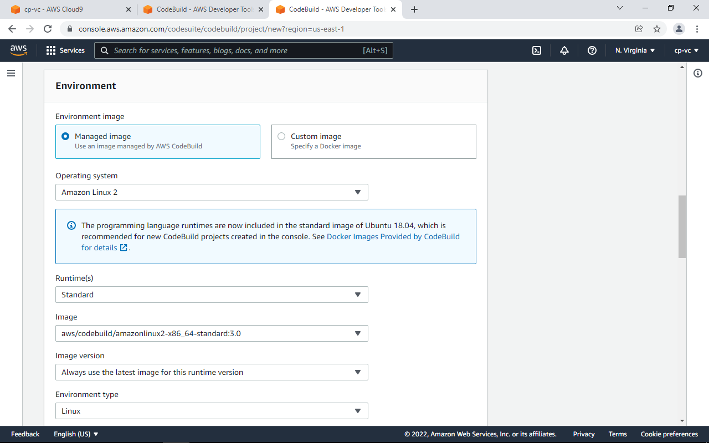
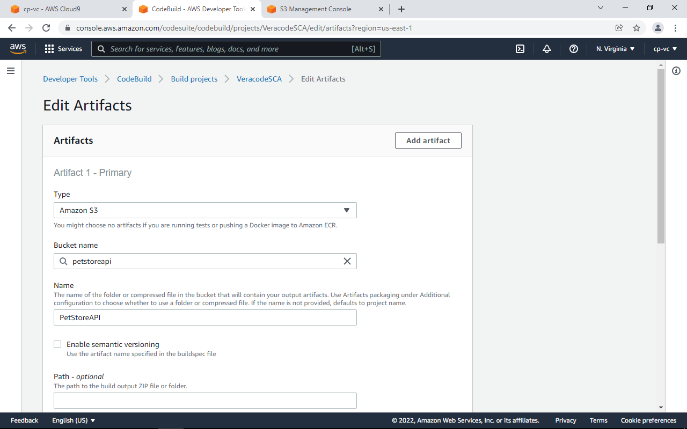
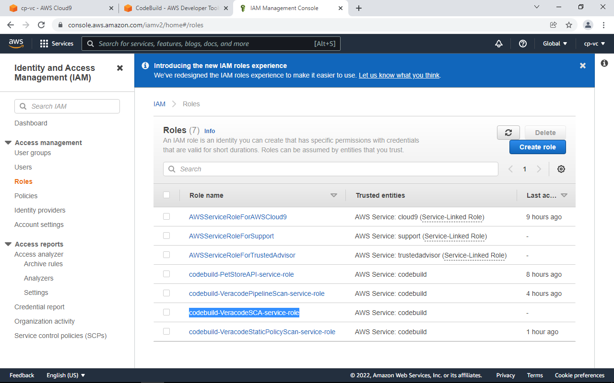
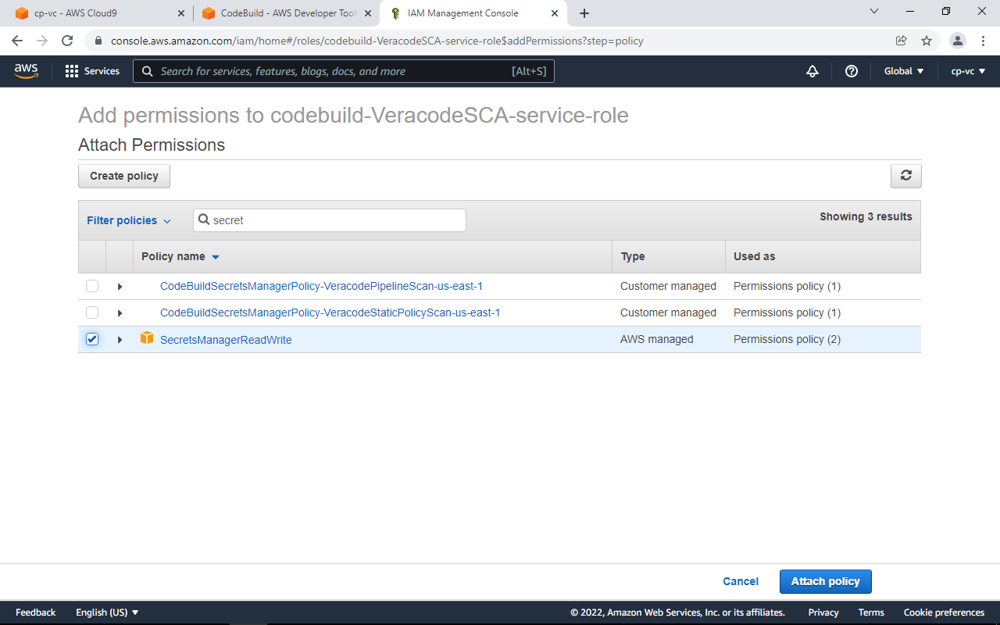
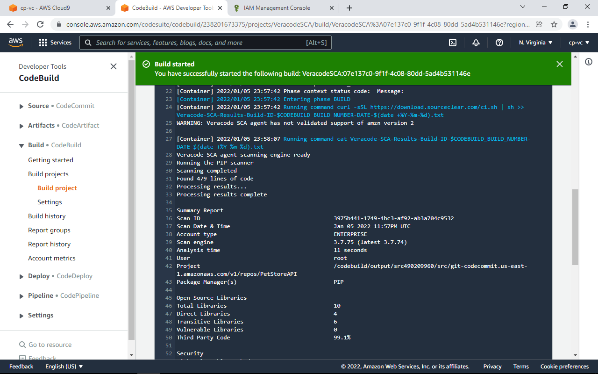
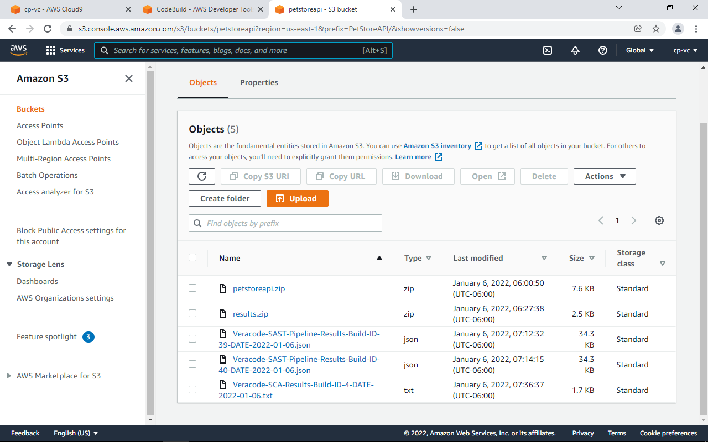

# Software Composition Analysis Advanced Scanning


SCA Advanced Scanning provides the following benefits:

* Vulnerable Methods Detection 
* Integrate directly into your pipeline
* SCA Container scanning






Use this for the buildspec.

```bash
 version: 0.2

env:
  secrets-manager:
     SRCCLR_API_TOKEN: "veracode:SRCCLR_API_TOKEN"
phases:
  build:
    commands:
      - curl -sSL https://download.sourceclear.com/ci.sh | sh >> Veracode-SCA-Results-Build-ID-$CODEBUILD_BUILD_NUMBER-DATE-$(date +%Y-%m-%d).txt
      - cat Veracode-SCA-Results-Build-ID-$CODEBUILD_BUILD_NUMBER-DATE-$(date +%Y-%m-%d).txt
  post_build:
    commands:
       - ls -la
artifacts:
  files:
    - Veracode-SCA-Results-Build-ID-$CODEBUILD_BUILD_NUMBER-DATE-$(date +%Y-%m-%d).txt
```

Set the Artifacts location so we can save SCA results to the S3 bucket.



Save project, then go into IAM - Roles and click on the role with the name similar to the CodeBuild project you created.




Attach Polices, search for SecretManagerReadWrite.



Run the build and you should see the SCA results!



We’ve also uploaded the results to the S3 bucket.



## [Continue to SCA Container Scan](/SCA-Container-Scan)