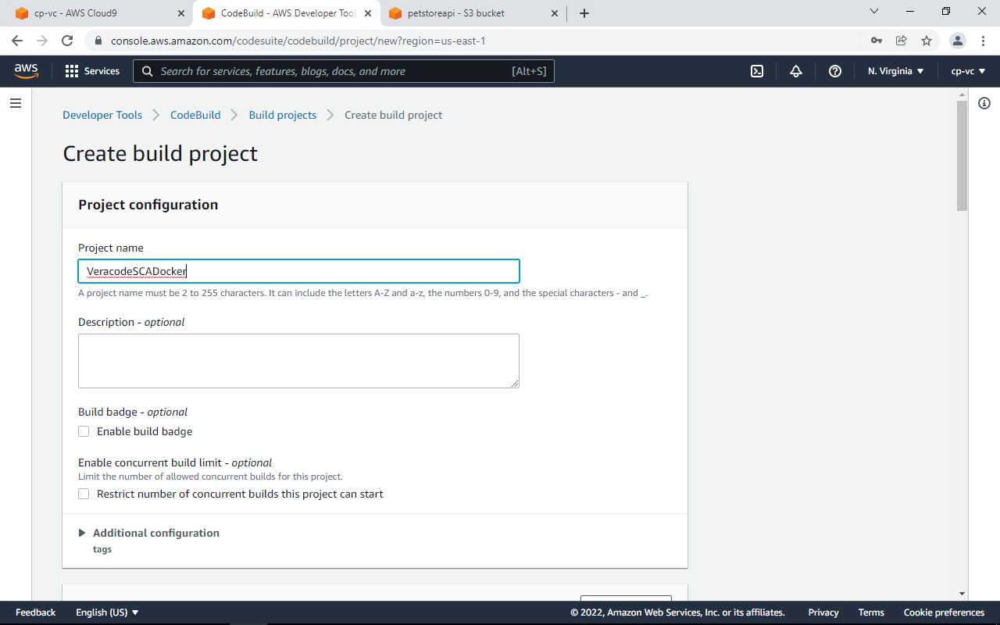
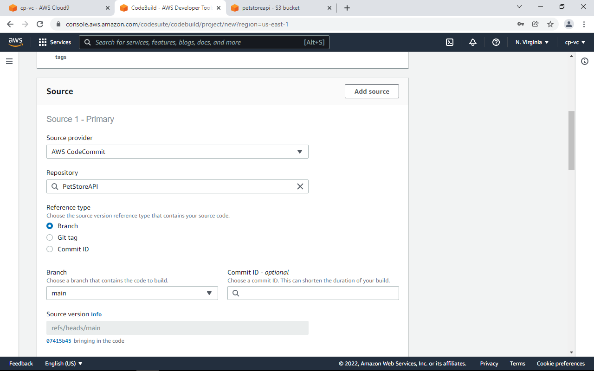
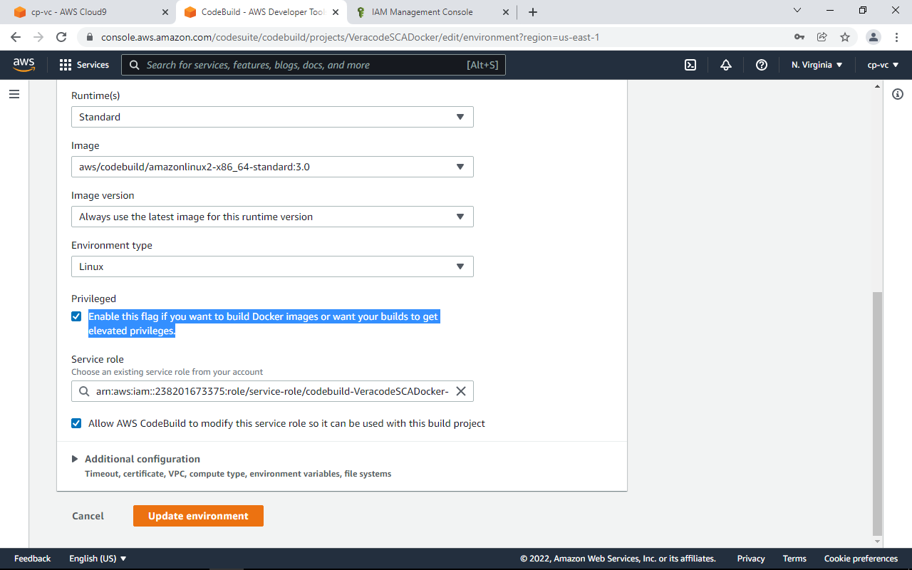
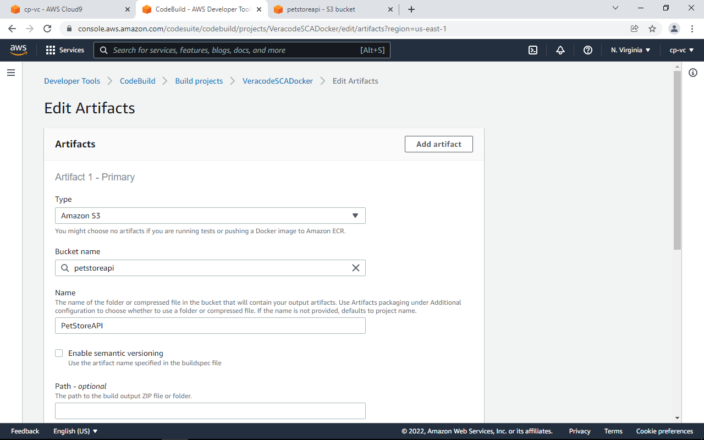
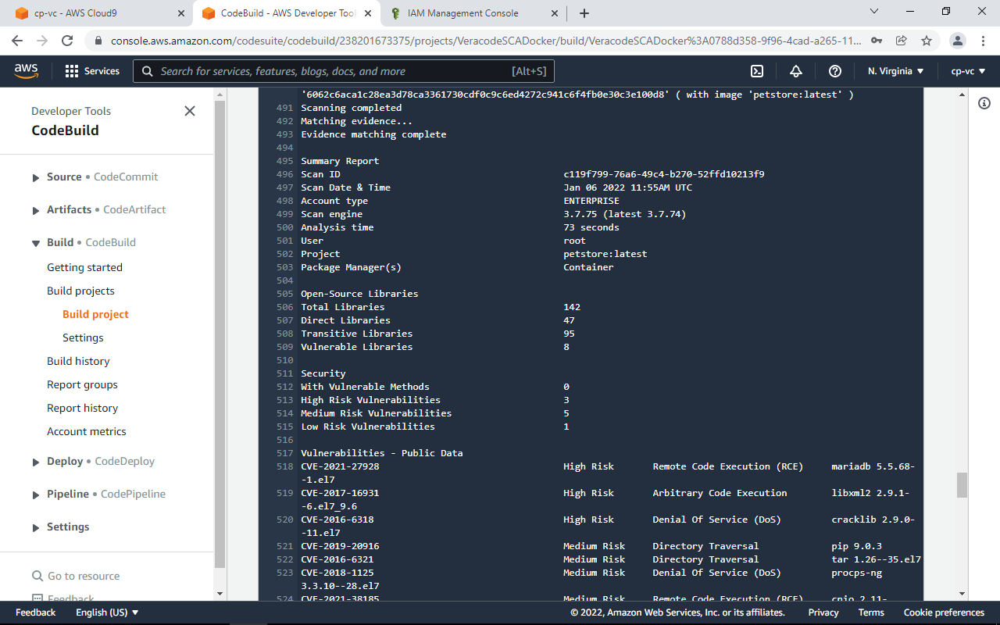
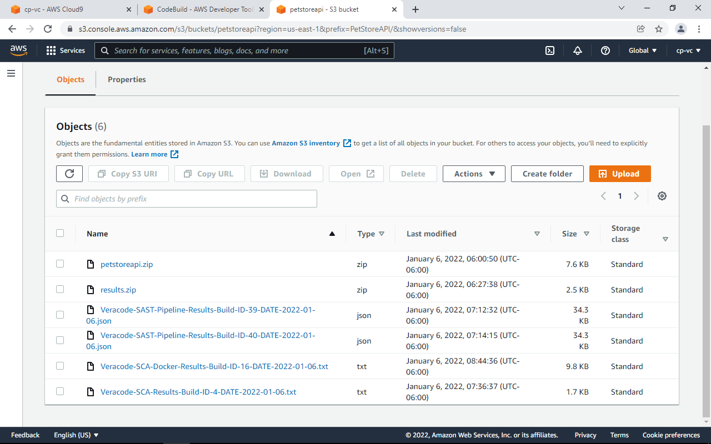

# SCA Container Scanning

Create a new BuildProject.





Be sure to check the box Enable this flag to build Docker Images.



Use buildspec:

```bash
 version: 0.2

env:
  secrets-manager:
     DOCKERHUB_PASSWORD: "dockerhub:password"
     DOCKERHUB_USERNAME: "dockerhub:username"
     SRCCLR_API_TOKEN: "veracode:SRCCLR_API_TOKEN"
phases:
  build:
    commands:
      - echo "${DOCKERHUB_PASSWORD}" | docker login -u "${DOCKERHUB_USERNAME}" --password-stdin
      - docker build -t petstore .
      - curl -sSL https://download.sourceclear.com/ci.sh | sh -s scan --image petstore > Veracode-SCA-Docker-Results-Build-ID-$CODEBUILD_BUILD_NUMBER-DATE-$(date +%Y-%m-%d).txt
      - cat Veracode-SCA-Docker-Results-Build-ID-$CODEBUILD_BUILD_NUMBER-DATE-$(date +%Y-%m-%d).txt
      - ls -la
artifacts:
  files:
    - Veracode-SCA-Docker-Results-Build-ID-$CODEBUILD_BUILD_NUMBER-DATE-$(date +%Y-%m-%d).txt
```

Set artifact location



Before running the build, repeat the secrets permissions process, and then run the build.



You’ll also notice the SCA Docker output has been stored in our S3 bucket.


