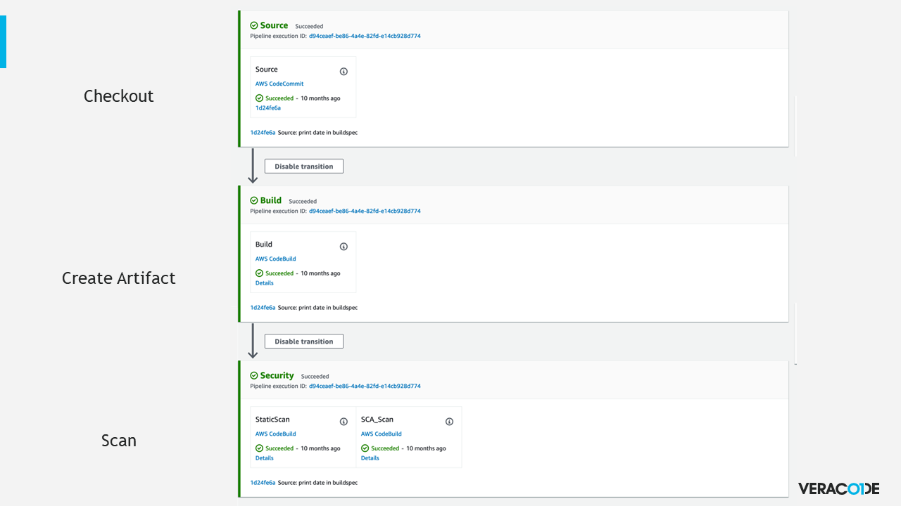

# AWS CodeSuite and Veracode

How to setup an AWS CodeSuite with Veracode Static, Software Composition Analysis, and Dynamic Analysis.

## Overview
Veracode integrates with products in the AWS CodeSuite such as CodeBuild and CodePipeline.

For this demonstration we will use the PetStoreAPI written in Python.  
https://github.com/veracode/petstore-api-flask

### AWS Products We’ll Use:

* CodeBuild - this is the primary area we integrate Veracode commands. 
* Cloud9 IDE - we'll use this to run a Docker image for the DAST scan.
* CodePipeline - integrate your security checks into your pipeline

The basic flow we'll be demonstrating is Checkout - Artifact - Scan.

### [Static Analysis and Software Composition Analysis Scanning](QuickStart/SAST_SCA_PolicyScan/)
* Create CodeBuild project
* Enter API keys in environment variables
* Paste in provided buildspec and submit the scan

### [Dynamic Scanning](QuickStart/DAST/)
* Use Cloud9 IDE to run the PetstoreAPI Docker Image
* Allow Veracode IP address to access Cloud9 via security group
* Submit the DAST scan

### [Advanced](/Advanced/)
* Create S3 bucket for artifact storage
* Create AWS CodeBuild project to submit the scan
* Pull request or component scanning with the SAST Pipeline scanner
* Create OSS Bill of Materials (SCA) for the Docker image itself
* Setup and run a DAST scan
* Using a Veracode Docker image